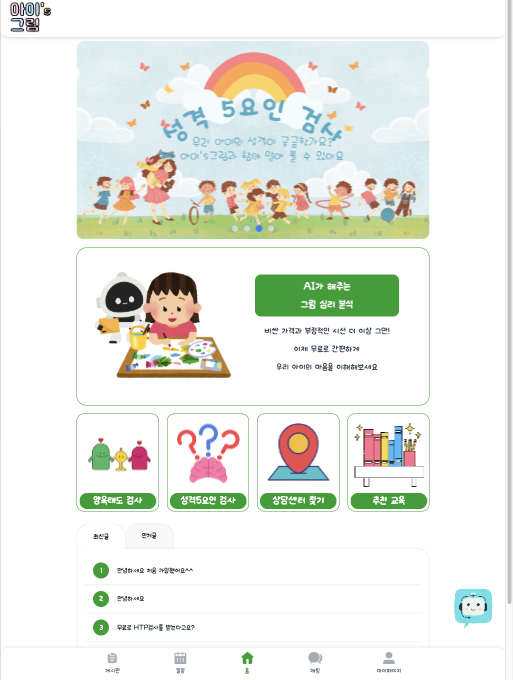
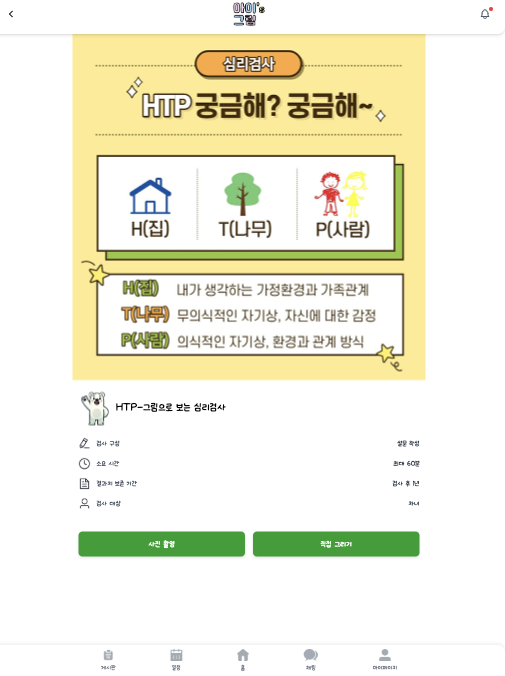
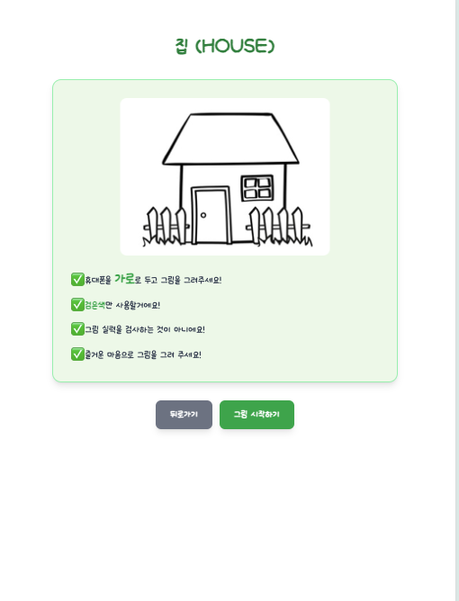
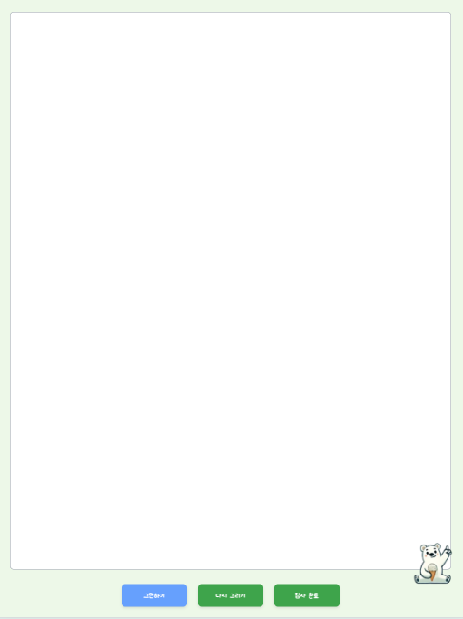
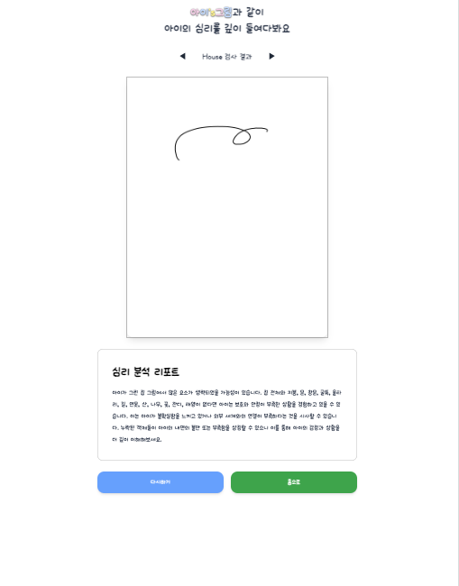
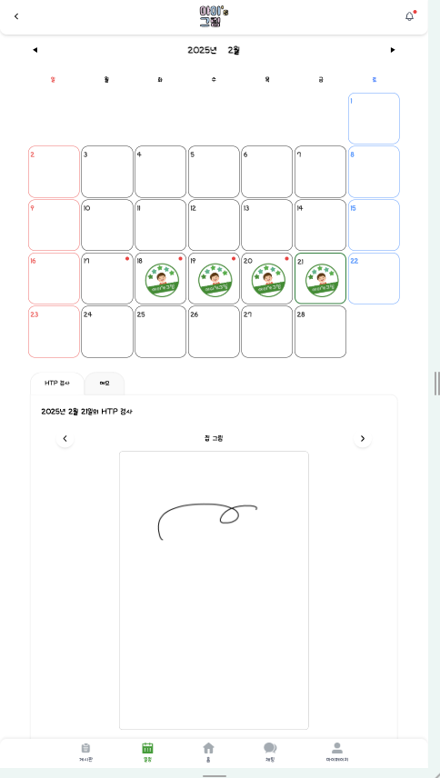
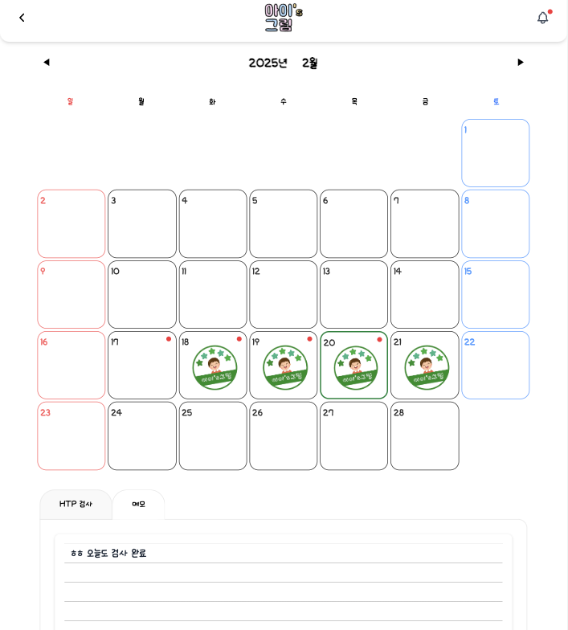
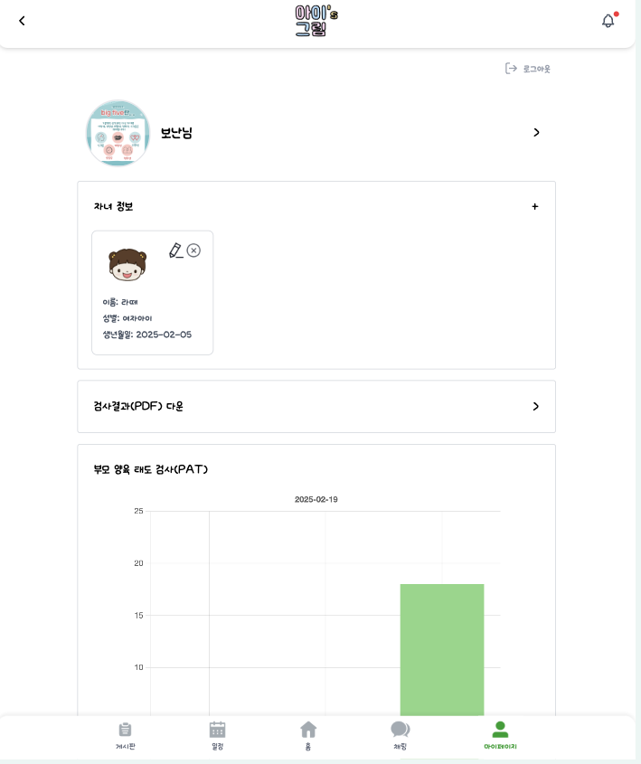
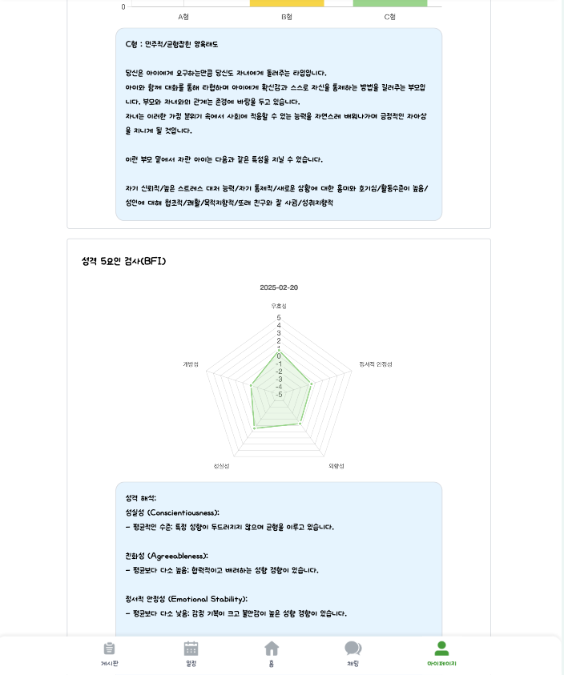

# 아이's 그림 Frontend

AI가 해주는 아이심리 검사사 서비스의 프론트엔드 프로젝트입니다.

## 🛠️ 기술 스택

- **Framework:** React + TypeScript
- **Build Tool:** Vite
- **State Management:** Redux + Redux Persist
- **Styling:** TailwindCSS
- **API Client:** Axios
- **PWA Support:** Vite PWA Plugin
- **Map Integration:** Kakao Maps API

## 📁 프로젝트 구조

```
src/
├── assets/         # 이미지, 폰트 등 정적 파일
├── components/     # 재사용 가능한 컴포넌트
├── hooks/         # 커스텀 훅
├── pages/         # 페이지 컴포넌트
├── store/         # Redux 스토어 설정
├── types/         # TypeScript 타입 정의
└── utils/         # 유틸리티 함수
```

## 🚀 시작하기

### 환경 설정

1. `.env` 파일 생성:

```env
VITE_KAKAO_MAP_API_KEY=your_api_key
VITE_API_BASE_URL=your_api_url
```

2. 의존성 설치:

```bash
npm install
```

### 개발 서버 실행

```bash
npm run dev
```

### 프로덕션 빌드

```bash
npm run build
npm run preview
```

## 🔐 환경 변수

| 변수명                 | 설명                | 필수 여부 |
| ---------------------- | ------------------- | --------- |
| VITE_KAKAO_MAP_API_KEY | 카카오맵 API 키     | ✅        |
| VITE_API_BASE_URL      | 백엔드 API 기본 URL | ✅        |

## 👥 Team Members

| 이름   | 역할                | GitHub                                 |
| ------ | ------------------- | -------------------------------------- |
| 박보성 | Frontend Lead       | [@github](https://github.com/bseong23) |
| 서건호 | Frontend Developer  | [@github](링크)                        |
| 김유정 | FullStack Developer | [@github](링크)                        |

## 📝 주요 기능

- 아이 심리 검사
- 부모 심리 검사
- 실시간 챗봇 상담
- 검사 결과 시각화
- 위치 기반 상담사 찾기

## 📸 Screenshots

### 메인 페이지



### 검사 페이지





### 결과 페이지



### 캘린더 페이지




### 마이 페이지




## 🚨 Trouble Shooting

### PWA 캐싱 이슈

- 인원: 박보성
- 문제: 새로고침이 계속되는 이슈 발생(캐싱 관련)
- 해결: 자동으로 업데이트가 되는게 아닌 사용자에게 물어서 되도록 반영

### FireBase

- 인원: 박보성
- 문제: 파이어베이스 연동 문제
- 해결: firebase-messaging-sw로 해결, 백그라운드에서도 작동되게 적용

### accessToken

- 인원: 박보성
- 문제: 로컬스토리지에 저장된 access 토큰이 api 요청 시 헤더에 담기지 않음
- 해결: axiosInstance를 만들어 모든 요청시 올바른 토큰을 헤더에 담아 요청 보내도록 request interceptors 설정

### KakaoMap API 연동 및 API 키 보안

- 인원: 박보성
- 문제: 카카오맵 API연동 불가 문제 발생
- 해결: kakao developers에서 설정으로 연동 해결 후 카카오의 키를 받아서 환경변수에 넣어 API 보안 유지

### 아동의 집중력 향상 문제

- 인원: 박보성
- 문제: 설문 유형의 아동 심리 검사에서 아동의 집중력 문제 발생
- 해결: canvas-confetti를 활용해 폭죽효과 추가 및 동적인 캐릭터 효과로 집중력 향상을 도모

### 로고 및 사이트 이미지 문제

- 인원: 박보성
- 문제: 로고와 사이트에서 사용되는 아이콘 및 배너 문제 발생
- 해결: Canva와 GIF를 활용하여 직접 만든 디자인으로 해결

### 로고 및 사이트 이미지 문제

- 인원: 박보성
- 문제: 로고와 사이트에서 사용되는 아이콘 및 배너 문제 발생
- 해결: Canva와 GIF를 활용하여 직접 만든 디자인으로 해결

## 🔍 브라우저 지원

- Chrome (최신 버전)
- Firefox (최신 버전)
- Safari (최신 버전)
- Edge (최신 버전)

## 💬 Commit Convention

- Feat: 새로운 기능 추가
- Fix: 버그 수정
- Docs: 문서 수정
- Markup: 코드 포맷팅, 세미콜론 누락, 코드 변경이 없는 경우
- Refactor: 코드 리팩토링
- Test: 테스트 코드, 리팩토링 테스트 코드 추가
- Desing: 디자인

## 👥 Contributing

1. 이 저장소를 포크합니다
2. 새 브랜치를 생성합니다 (`git checkout -b feature/amazing-feature`)
3. 변경사항을 커밋합니다 (`git commit -m 'Add some amazing feature'`)
4. 브랜치에 푸시합니다 (`git push origin feature/amazing-feature`)
5. Pull Request를 생성합니다

## 📄 License

This project is licensed under the MIT License - see the [LICENSE](LICENSE) file for details
