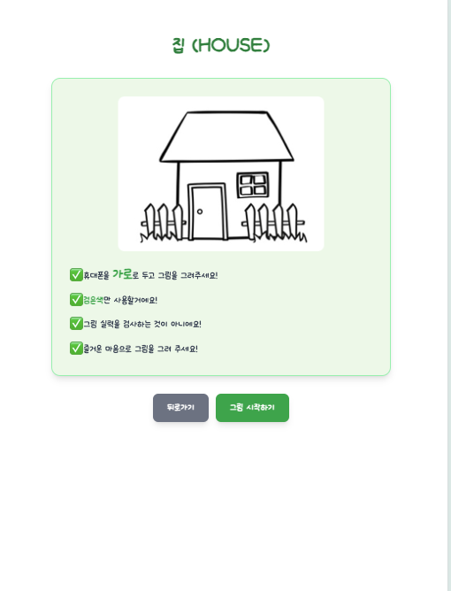
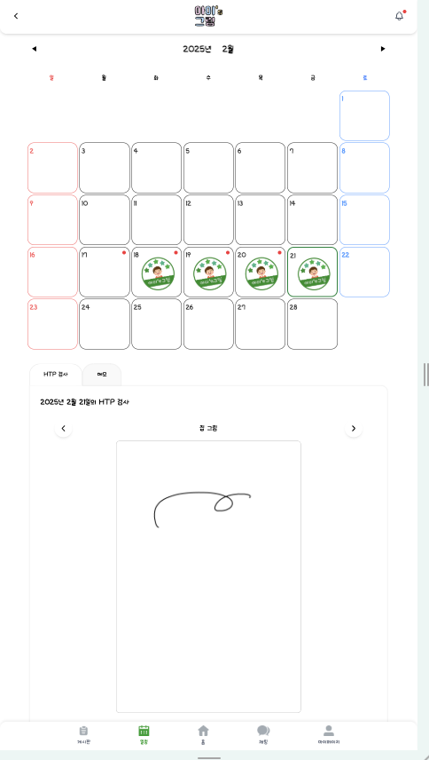
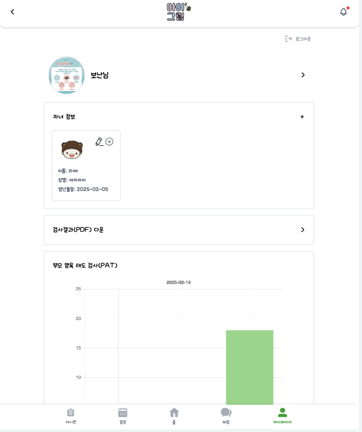

# A407 웹디자인 공통 프로젝트

# 프로젝트명 : 아이's 그림 (아동 미술 심리 검사)

## 팀명 : [A407]
| [서건호]                           | [권민채]                                  | [김유정]                                                 | [박동민]                                                                | [박보성]                                          | [이재홍]                                        |
|---------------------------------|----------------------------------------|-------------------------------------------------------|----------------------------------------------------------------------|------------------------------------------------|----------------------------------------------|
| - 팀장 - 프론트엔드  | - 백엔드 - DB 설계 - API 개발 | - 백엔드 - DB 설계 - API 개발 | - 프론트엔드 | - 프론트엔드 | - 백엔드 - AI 모델 개발 - DevOps - API 개발 |

## 💁‍♂️ Detail Role
[서건호]

- 프론트엔드 HTP 화면 구성 및 API 통신
- 회원 기능 화면 구성

[권민채]

- SpringSecurity + JWT를 사용한 인증/인가 작업
- 공통 응답/예외처리
- 게시글, 댓글/대댓글 기능 구현
- Firebase를 이용한 알림 기능 구현
- S3 파일 업로드/삭제 구현

[김유정]

- 프론트엔드
- 백엔드 Big-5, PAT API 구현

[박동민]

- 백엔드 API 설계 및 구현
- 채팅 구현

[박보성]

- 프론트엔드
- 커뮤니티
- 캘린더 및 메모
- 알림

[이재홍]

- Yolo v8과 RAG 기반의 HTP 검사
- CI/CD 파이프라인 구축 및 배포 자동화

## Languages

## Technologies

## 📝 목차
- [개요](#-개요)
- [Pain Point](#-pain-point)
- [Idea / Solution](#-idea--solution)
- [아키텍처](#-아키텍처)
- [결과물](#-결과물)
- [협업 방식](#-협업-방식)
- [팀의 개발 문화](#-팀의-개발-문화)
- [ERD](#-erd)
- [성과 및 회고](#-성과-및-회고)

## 📝 개요
아이'S그림은 AI로 아이들의 심리 상태를 간편하게 진단하는 아동심리 검사 서비스입니다. 최근 아동, 청소년의 정신건강 문제가 심화되고 있으며, 이를 조기에 발견하는 것이 중요합니다.
그래서 간편하게 핸드폰으로 그림을 그리고 AI를 이용해 HTP검사를 할 수 있습니다.

## 🧐 Pain Point
1. **심리 검사에 대한 부정적 인식**:심리 검사를 필요로 하는 사람은 증가하지만 여전히 사회적 인신을 좋지 않아 심리 검사를 꺼려하는 사람들이 많습니다.
2. **정보 부족으로 인해 조기 발견이 늦어짐**: 어디에 요청할지 몰라 조기 발견이 늦어지고 있는 상황입니다.

## 💡 Idea / Solution
### AI HTP 검사
- 총 4개의 그림(집, 나무, 여자사람, 남자사람)에 대해서 객체 검출을 수행한다.
- 검출 객체들(나무, 문, 창문, 굴뚝,,,)을 텍스트로 변환한다.
- 논문을 기준으로 객체의 특징을 나눈다 (ex. 굴뚝 → 크다, 오른쪽 상단에 위치)
- 변환된 텍스트를 HTP 결과 해석 모델에 넣어서 결과를 해석한다.
- 결과 출력

### 캘린더 기능
- 캘린더를 통해 HTP 검사 기록을 확인할 수 있음
- 간단한 메모 기능을 통해 아이에 관한 정보 기록 가능

### BIG-FIVE 검사 기능
- 아이의 성격을 5가지 유형으로 확인할 수 있는 빅파이브 설문조사 제공
- 주기적으로 진행함으로써 아이의 성격 형성 과정을 확인할 수 있음음

### PAT 검사 기능
- 부모 양육 태도 검사 제공
- 부모의 양육 태도를 검사함으로써 아이 양육에 도움을 줌

### 커뮤니티 기능
- 아이 양육에 관한 고민을 나눌 수 있음
- 채팅을 통해 개인적인 대화 가능

### 주변 심리 상담 센터 제공
- 현재 위치 기반으로 주변에 있는 심리 상담 센터 목록 제공

### 심리 관련 교육 영상 제공
- 아이의 현재 심리와 상태를 기반으로 그에 맞는 교육 영상 제공

### 차별화 포인트
- AI를 이용해 그림을 판단해 심리 검사를 할 수 있는 것
- 캘린더 기능을 통해 주기적인 관리

## 📈 아키텍처

### 시스템 구성
- **프론트엔드**: React, JavaScript, TypeScript
- **백엔드**: Spring Boot (RESTful API, WebSocket)
- **데이터베이스**: MySQL (주 데이터 저장), Redis (캐싱), MongoDB (채팅)
- **인프라**: AWS EC2, S3
- **CI/CD**: Jenkins, Docker, Gitlab Webhook
- **AI**: gpt-4, LangChain, ChromaDB, Yolo v8

### 보안 구조
- JWT 기반 인증/인가

## 🎁 결과물
### 메인 페이지

### 검사 페이지

### 결과 페이지

### 캘린더 페이지

### 마이 페이지

## ⏰ 협업 방식
- Notion, GitLab Issue, Jira를 모두 사용하여 팀원의 작업 상황과 논의 사항 빠르게 공유

### 일정 관리
- Jira를 활용한 스프린트 기반 애자일 개발
- 1주 단위 스프린트로 MVP 및 추가 기능 개발 관리
- 일일 스탠드업 미팅으로 진행 상황 공유 및 블로커 해결

### 코드 리뷰 프로세스
- GitLab MR(Merge Request)을 통한 코드 리뷰
- 최소 1명 이상의 승인 필요
- 코드 컨벤션 준수 및 리뷰 필수
- 코드 리뷰를 통해 코드 개선 방향, 발전 방향 제시

### 문서화
- Confluence를 활용한 기술 문서 및 회의록 관리
- API 문서 자동화 (Swagger)
- 아키텍처 및 플로우 다이어그램 작성

## 🎈 팀의 개발 문화
### 핵심 원칙
- 필요한 내용은 바로 직접 소통을 통해 해결하고, 전달이 어려운 정보는 반드시 문서화하여 공유한다.
- 모든 결정사항과 회의록은 문서화하여 팀원 사이 Align 유지한다.
- 문제 발생 시 혼자 해결하는 것이 아니라 팀에 빠르게 상황을 공유하고 함께 해결책을 모색한다.
- 개인의 성장과 팀의 성장을 동시에 추구하여, 다양한 기술 정보나 기회를 공유한다.

### 소통 방식
- 매일 아침, 15분 스탠드업 미팅

## 📈 ERD

## 📌 성과 및 회고
### 프로젝트 성과
- **기술적 성과**:
    - 멀티 스레드를 사용하여 4개의 모델(Yolo v8 + rag)이 동시에 실행되게 설계 (60초 걸리던 작업이 13초로 감소)

- **비즈니스 성과**:
    - 2학기 프로젝트 우수상(1등) 수상

### 배운 점
- **기술적 측면**:
    - Redis를 이용한 효율적인 데이터 저장
    - Yolo v8, RAG를 활용한 AI 개발 경험

- **협업 측면**:
    - 애자일 방법론의 실제 적용 및 개선
    - 효과적인 기술 문서화 및 지식 공유 방법
    - 다양한 백그라운드를 가진 팀원 간 소통 개선

### 아쉬운 점 & 개선 방향
- **한계점**:
    - 그림으로만 판단하기 때문에 그림 그리는 과정은 판단할 수 없음

- **추후 개선 방향**:
    - Yolo v8모델의 최적화
    - RAG의 고도화
    - 할루시네이션 없애기
    - 영상으로도 확장하여 정확도 높이기

